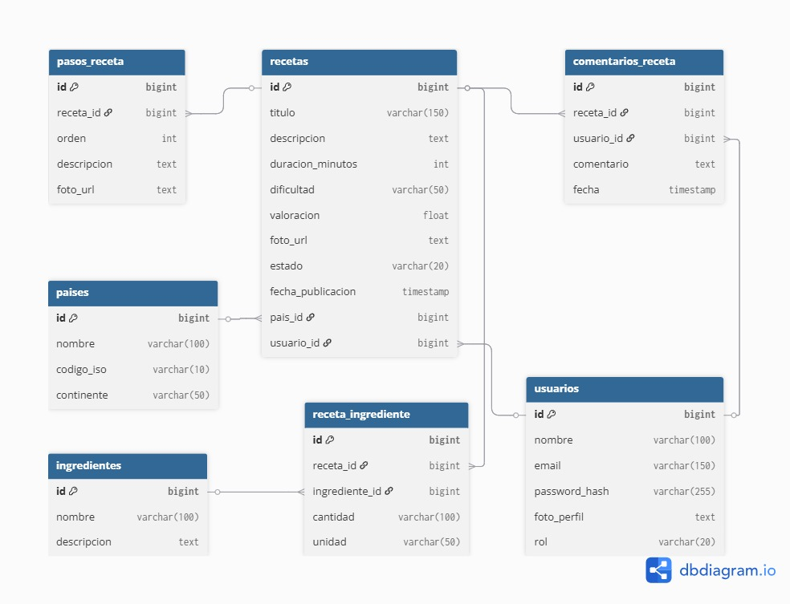

# 🍲 Recetas Backend

API RESTful desarrollada en Java y Spring Boot para la gestión de recetas culinarias, ingredientes, países, usuarios y comentarios. Incluye autenticación JWT, manejo de roles y pruebas automatizadas.

## 📌 Índice
- [Tech Stack](#-tech-stack)
- [Características](#-características)
- [Instalación](#️-instalación)
- [Configuración](#-configuración)
- [Estructura del Proyecto](#-estructura-del-proyecto)
- [Modelo de Base de Datos](#-modelo-de-base-de-datos)
- [Scripts](#-scripts)
- [API Endpoints](#-api-endpoints)
- [Pruebas](#-pruebas)
- [Contribución](#-contribución)a
- [Autor](#-autor)
- [Licencia](#-licencia)

## ⚡ Tech Stack


## 🚀 Características

- 🔐 Autenticación y autorización basada en JWT
- 👤 Gestión de usuarios: registro, login y roles
- 📝 CRUD de recetas, ingredientes y países
- 💬 Comentarios en recetas
- ⚠️ Manejo global de excepciones
- 🧪 Pruebas unitarias y de integración

## 🛠️ Instalación

```bash
# Clonar el repositorio
git clone <url-del-repositorio>
cd Recetas-Backend

# Instalar dependencias y compilar
mvn clean install
```

### Requisitos previos
- Java 17+
- Maven 3.8+

## ⚙️ Configuración

El archivo principal de configuración es `src/main/resources/application.properties`. Aquí se definen parámetros como la conexión a la base de datos, puerto del servidor y propiedades de seguridad.

## 📂 Estructura del Proyecto

```
Recetas-Backend/
├── pom.xml
├── src/
│   ├── main/
│      ├── java/com/saboresdelmundo/recetas/
│      │   ├── config/           # Configuraciones globales y de seguridad
│      │   ├── controller/       # Controladores REST
│      │   ├── docs/             # Documentación interna
│      │   ├── dto/              # Objetos de transferencia de datos
│      │   ├── model/            # Entidades del dominio
│      │   ├── repository/       # Interfaces de acceso a datos
│      │   ├── security/         # Seguridad y JWT
│      │   └── service/          # Lógica de negocio
│      └── resources/
│          └── application.properties
│
└── target/                        # Archivos generados por Maven
```

## 💾 Modelo de Base de Datos




- **usuarios**: Almacena la información de los usuarios registrados
- **paises**: Catálogo de países con sus códigos ISO
- **recetas**: Contiene las recetas con sus detalles básicos
- **ingredientes**: Catálogo de ingredientes disponibles
- **receta_ingrediente**: Relación muchos a muchos entre recetas e ingredientes
- **pasos_receta**: Pasos ordenados para la preparación de cada receta
- **comentarios_receta**: Comentarios de los usuarios en las recetas

## �📦 Scripts

- `mvn spring-boot:run` — Inicia el servidor de desarrollo
- `mvn clean package` — Genera el JAR ejecutable
- `mvn test` — Ejecuta los tests


Ejemplo de endpoints principales:

### Autenticación
- `POST /api/auth/register` — Registro de usuario
- `POST /api/auth/login` — Login de usuario

### Recetas
- `GET /api/recetas` — Listar recetas
- `POST /api/recetas` — Crear receta
- `PUT /api/recetas/{id}` — Actualizar receta
- `DELETE /api/recetas/{id}` — Eliminar receta

### Ingredientes
- `GET /api/ingredientes` — Listar ingredientes
- `POST /api/ingredientes` — Crear ingrediente
- `PUT /api/ingredientes/{id}` — Actualizar ingrediente
- `DELETE /api/ingredientes/{id}` — Eliminar ingrediente

### Países
- `GET /api/paises` — Listar países
- `POST /api/paises` — Crear país
- `PUT /api/paises/{id}` — Actualizar país
- `DELETE /api/paises/{id}` — Eliminar país

### Usuarios
- `GET /api/usuarios` — Listar usuarios
- `GET /api/usuarios/{id}` — Obtener usuario
- `PUT /api/usuarios/{id}` — Actualizar usuario
- `DELETE /api/usuarios/{id}` — Eliminar usuario

### Comentarios
- `GET /api/comentarios` — Listar comentarios
- `POST /api/comentarios` — Crear comentario
- `DELETE /api/comentarios/{id}` — Eliminar comentario


## 🤝 Contribución

1. Haz un fork del proyecto
2. Crea tu rama de feature (`git checkout -b feature/NuevaFeature`)
3. Realiza tus cambios y haz commit (`git commit -m 'Agrega nueva feature'`)
4. Haz push a tu rama (`git push origin feature/NuevaFeature`)
5. Abre un Pull Request

## 👩‍💻 Autor

**Vanderlene Oliveira**

[](https://linkedin.com/in/vanderleneo)
[](https://github.com/vanderleneo)

## 📄 Licencia

Este proyecto está bajo la Licencia MIT - ver el archivo [LICENSE.md](LICENSE.md) para más detalles.
